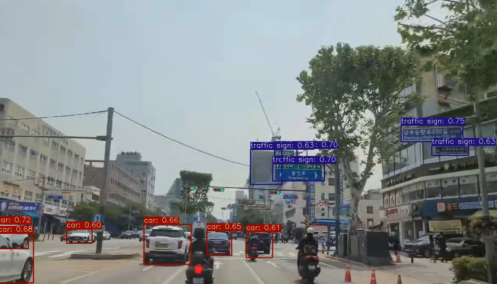

# 결과물 (Results)

이 폴더에는 모델 학습 및 평가 과정에서 생성된 결과물을 저장합니다.

---

## 실험 01: 커스텀 ConvNeXt 모델

첫 번째로 진행된 커스텀 ConvNeXt 백본 모델의 추론 결과 이미지입니다.

이 실험에 대한 자세한 가설, 과정, 분석은 프로젝트 루트의 [**`../docs/RESEARCH_LOG.md`**](../docs/RESEARCH_LOG.md) 파일에서 확인하실 수 있습니다.

### 1. 테스트 영상 프레임 추론 결과

-   **파일**: `06_01_test.png`
-   **설명**: 테스트 영상의 특정 프레임에 대해 객체 탐지를 수행한 결과입니다. 전반적인 탐지는 수행되나, 일부 프레임에서 **건물을 표지판(traffic sign)으로 잘못 인식하는 경우**가 발견되었습니다.

### 2. 일반 테스트 이미지 추론 결과

-   **파일**: `06_01_test2.png`
-   **설명**: 추가적인 단일 테스트 이미지에 대한 객체 탐지 결과입니다.

